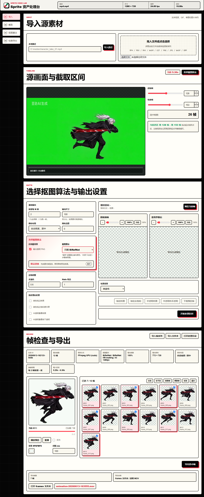

# Sprite Video Lab

[](https://github.com/xuxuan0817-collab/sprite-video-lab/actions/workflows/ci.yml)
[](https://xuxuan0817-collab.github.io/sprite-video-lab/)
[](https://github.com/xuxuan0817-collab/sprite-video-lab/releases/latest)

> GitHub Pages 提供项目介绍与下载入口。视频处理、AI 抠图和文件导出均在 Windows 本机运行，不会把素材上传到 Pages。

Sprite Video Lab 是一个本地网页工具，用来把视频片段、单张图片或已有序列帧整理成干净的 2D Sprite 资源。

它适合这些工作流：

- 导入本地视频、GIF 动图、单张图片或一次性多图序列帧。
- 截取有用的帧范围。
- 按固定间隔抽帧。
- 去除纯色背景、绿幕/蓝幕背景或 AI 生成背景。
- 用 Luma 保留发光、火焰、闪电、粒子等亮部特效。
- 统一帧尺寸，支持自动宽度画布或方形落地/居中画布。
- 对已处理帧执行 MAGIC 二次处理：Real-ESRGAN anime x4 超分后输出原尺寸 1/2、1/4、1/8 三档。
- 导出 frames 文件夹和自动时间命名的透明 WebM。

项目优先服务 Windows 本地工作流，但运行时很轻：Python、Pillow、ffmpeg，以及原生 HTML/CSS/JavaScript。

## 界面全貌



## 功能

- 本地路径导入和拖拽上传。
- 视频区间预览，支持按帧设置起止位置。
- 批处理前先单帧预览参数效果。
- 自动宽度居中画布，适合横向连招、特效条、多姿态行。
- 纯色/绿幕抠图，支持阈值、软边、去色溢出和 Halo 收缩。
- BiRefNet AI 主体抠图。
- Luma 亮度抠图，用来保留发光、火焰、闪电、粒子和亮部 VFX。
- CorridorKey 绿幕/蓝幕边缘精修和前景颜色重建。
- BiRefNet 与 Luma/CorridorKey 可选择“补亮部/精修边缘”或“收紧抠图”两类组合方式。
- 主体保护预设，减少 BiRefNet/Luma 把主体内部抠成半透明的问题。
- 单帧预览支持原始抽帧全分辨率查看，处理后预览可切换棋盘格或指定纯色背景。
- 预览和批处理后处理：残绿涂黑、残绿去饱和、半透明像素涂黑、半透明像素转不透明。
- BiRefNet 弱蒙版会自动回退到 general 模型，避免小尺寸插画/GIF 被抠成全透明。
- 可直接导入已有动画序列帧，按文件名顺序预览和导出。
- 实验性线稿清理页：支持 Lanczos 缩小和 Real-ESRGAN anime 整线后缩小。
- 反向动画预览和反向导出。
- MAGIC 帧预览：对选中帧使用 Real-ESRGAN anime 放大后缩小，支持硬边/软边缩放算法切换，并可上下对比原帧、1/2、1/4、1/8 三档结果。
- 帧选择、动画预览、frames 文件夹导出和自动时间命名的透明 WebM 导出。

## MAGIC 二次处理

在“检查导出”区域点击 `MAGIC` 后，工具会对当前选中的处理后帧执行一次 Real-ESRGAN anime x4 超分，再派生出三套透明 PNG：

- `MAGIC 1/2`：输出画布为原尺寸的 1/2。
- `MAGIC 1/4`：输出画布为原尺寸的 1/4。
- `MAGIC 1/8`：输出画布为原尺寸的 1/8。

MAGIC 按钮旁的 `硬` / `软` 选项决定超分后缩小的算法：

- `硬`：nearest-neighbor 缩小，保留像素硬边缘，适合 Sprite 动画。
- `软`：BOX 缩小，会平滑边缘，适合需要更柔和抗锯齿的素材。

每个 MAGIC 预览框都有自己的“导出处理后帧”按钮。导出结果会写入 `work/exports/`，并在页面底部生成“打开 frames 文件夹”和透明 WebM 链接。

## 抠图模式

Sprite Video Lab 目前提供这些背景处理模式：

- `chroma key`：快速处理受控纯色背景，适合绿幕、蓝幕、白底、灰底等素材。
- `只用 BiRefNet`：AI 主体抠图，适合非纯色背景或生成图背景。
- `只用 CorridorKey`：先用绿幕算法生成粗 alpha，再用 CorridorKey 重建边缘和前景颜色。
- `只用 Luma`：基于亮度生成 alpha，适合亮部特效、火焰、闪电、粒子等素材。
- `BiRefNet 粗蒙版 / CorridorKey 精修边缘`：BiRefNet 先给主体 alpha，再用 CorridorKey 做绿幕/蓝幕边缘重建。
- `BiRefNet 后再用 CorridorKey 收紧抠图`：先做 CorridorKey 精修，再与 BiRefNet alpha 相交，只进一步删除背景。
- `BiRefNet 保主体 / Luma 补亮部`：主体 alpha 加亮度 alpha，适合 VFX 比较重的 Sprite。
- `BiRefNet 后再用 Luma 收紧抠图`：BiRefNet alpha 与亮度 alpha 相交，让 Luma 进一步删掉不够亮的背景。
- `BiRefNet + Luma 合并后 / CorridorKey 精修`：先合成主体 alpha 和亮度 alpha，再用 CorridorKey 做边缘/颜色重建。
- `不抠图`：素材已经带透明通道时，只做缩放、对齐和导出。

灰底、白底、黑底素材通常不需要去色溢出；绿幕/蓝幕素材再开启 despill 和 CorridorKey 会更稳。

## 环境要求

- Python 3.10+
- Pillow
- ffmpeg / ffprobe
- 可选 AI 环境：
  - PyTorch
  - torchvision
  - transformers
  - huggingface-hub
  - timm 和相关图片依赖
  - CorridorKey 依赖，例如 `safetensors`、OpenCV、NumPy

基础功能只需要 `requirements.txt`。BiRefNet、Luma 组合和 CorridorKey 相关能力需要 `requirements-ai.txt` 里的可选依赖。

## 安装

安装交给 agent 执行，避免手动配置 Python、ffmpeg、AI 依赖和模型缓存时出错。

- Agent 安装说明：[AGENT_INSTALL.md](./AGENT_INSTALL.md)
- AI 抠图细节：[AI_MATTING.md](./AI_MATTING.md)

安装完成后，agent 应启动本地服务并给出访问地址。默认地址：

```text
http://127.0.0.1:8894
```

实验性线稿清理页：

```text
http://127.0.0.1:8894/app/line-cleaner-experiment.html
```

## 使用说明

完整的导入、截取、抠图模式、Luma 主体保护、CorridorKey 精修、后处理、动画预览、反向导出和排错说明见：

- [中文使用说明](./USAGE.zh-CN.md)
- [English usage guide](./USAGE.md)

## 环境变量

- `SPRITE_VIDEO_LAB_HOST`
  - 默认：`127.0.0.1`
- `SPRITE_VIDEO_LAB_PORT`
  - 默认：`8894`
- `SPRITE_VIDEO_LAB_FFMPEG_DIR`
  - 可选，包含 `ffmpeg(.exe)` 和 `ffprobe(.exe)` 的目录
- `SPRITE_VIDEO_LAB_FFMPEG_ACCEL`
  - 可选，支持 `auto`、`cpu`、`cuda`、`qsv`、`d3d11va`、`dxva2`
- `SPRITE_VIDEO_LAB_AI_MODEL_CACHE`
  - 可选，Hugging Face / AI 模型缓存目录
- `SPRITE_VIDEO_LAB_CORRIDORKEY_ROOT`
  - 可选，CorridorKey checkout 和 checkpoint 目录
- `SPRITE_VIDEO_LAB_PYTHON`
  - 可选，启动器使用的 Python 可执行文件
- `SPRITE_VIDEO_LAB_REALESRGAN_BIN`
  - 可选，MAGIC 二次处理和 Real-ESRGAN anime 线稿清理使用的 `realesrgan-ncnn-vulkan` 可执行文件
- `SPRITE_VIDEO_LAB_REALESRGAN_MODEL_DIR`
  - 可选，包含 `realesrgan-x4plus-anime.param` 和 `.bin` 的模型目录

也可以从命令行覆盖 host 和 port：

```bash
python server.py --host 127.0.0.1 --port 8894
```

## 项目结构

```text
app/                              前端 UI 和浏览器逻辑
app/line-cleaner-experiment.*     实验性线稿缩小清理页面
server.py                         本地 HTTP 服务和处理流水线
AGENT_INSTALL.md                  给 agent 执行的安装和启动说明
requirements.txt                  基础运行依赖
requirements-ai.txt               可选 AI 抠图依赖
setup_ai_runtime.bat              Windows AI 环境安装脚本
start_sprite_video_lab.bat        Windows 启动器
start_sprite_video_lab_portable.bat 便携版启动器
build_portable_bundle.ps1         便携版打包脚本
work/                             运行时输出目录，已被 git 忽略
```

## 注意事项

- 不要把 `work/`、生成帧、测试视频、模型缓存和虚拟环境提交到 git。
- AI 模型会在第一次选择相关模式时由本地运行时下载。
- BiRefNet 通过 Hugging Face 的 `trust_remote_code=True` 加载远程模型代码；如果需要更严格的供应链控制，请审查并固定模型 revision。
- CorridorKey 是独立项目，重新分发或用于商业推理服务前请确认它的许可证。

## English

This README is Chinese-first. For English instructions, see [USAGE.md](./USAGE.md).

## License

[MIT](./LICENSE)
